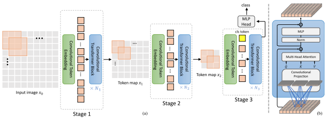

## CvT

</img>

"We present in this paper a new architecture, named Convolutional vision Transformer (CvT), that improves Vision Transformer (ViT) in performance and efficiency by introducing convolutions into ViT to yield the best of both designs. This is accomplished through two primary modifications: a hierarchy of Transformers containing a new convolutional token embedding, and a convolutional Transformer block leveraging a convolutional projection. These changes introduce desirable properties of convolutional neural networks (CNNs) to the ViT architecture (\ie shift, scale, and distortion invariance) while maintaining the merits of Transformers (\ie dynamic attention, global context, and better generalization). We validate CvT by conducting extensive experiments, showing that this approach achieves state-of-the-art performance over other Vision Transformers and ResNets on ImageNet-1k, with fewer parameters and lower FLOPs. In addition, performance gains are maintained when pretrained on larger datasets (\eg ImageNet-22k) and fine-tuned to downstream tasks. Pre-trained on ImageNet-22k, our CvT-W24 obtains a top-1 accuracy of 87.7\% on the ImageNet-1k val set. Finally, our results show that the positional encoding, a crucial component in existing Vision Transformers, can be safely removed in our model, simplifying the design for higher resolution vision tasks." - Haiping Wu, Bin Xiao, Noel Codella, Mengchen Liu, Xiyang Dai, Lu Yuan, Lei Zhang

### Research Paper:
- https://arxiv.org/abs/2103.15808

### Official repository:
- https://github.com/microsoft/CvT

### Usage:
```python
import numpy

key = jax.random.PRNGKey(0)

img = jax.random.normal(key, (1, 256, 256, 3))

v = CvT(
    num_classes = 1000,
    s1_emb_dim = 64,        # stage 1 - dimension
    s1_emb_kernel = 7,      # stage 1 - conv kernel
    s1_emb_stride = 4,      # stage 1 - conv stride
    s1_proj_kernel = 3,     # stage 1 - attention ds-conv kernel size
    s1_kv_proj_stride = 2,  # stage 1 - attention key / value projection stride
    s1_heads = 1,           # stage 1 - heads
    s1_depth = 1,           # stage 1 - depth
    s1_mlp_mult = 4,        # stage 1 - feedforward expansion factor
    s2_emb_dim = 192,       # stage 2 - (same as above)
    s2_emb_kernel = 3,
    s2_emb_stride = 2,
    s2_proj_kernel = 3,
    s2_kv_proj_stride = 2,
    s2_heads = 3,
    s2_depth = 2,
    s2_mlp_mult = 4,
    s3_emb_dim = 384,       # stage 3 - (same as above)
    s3_emb_kernel = 3,
    s3_emb_stride = 2,
    s3_proj_kernel = 3,
    s3_kv_proj_stride = 2,
    s3_heads = 4,
    s3_depth = 10,
    s3_mlp_mult = 4,
    dropout = 0.
)

init_rngs = {'params': jax.random.PRNGKey(1), 
            'dropout': jax.random.PRNGKey(2)}

params = v.init(init_rngs, img)
output = v.apply(params, img, mutable=['batch_stats'], rngs=init_rngs)

n_params_flax = sum(
    jax.tree_leaves(jax.tree_map(lambda x: numpy.prod(x.shape), params))
)
print(f"Number of parameters in Flax model: {n_params_flax}")
```
```bibtex
@article{DBLP:journals/corr/abs-2103-15808,
  author    = {Haiping Wu and
               Bin Xiao and
               Noel Codella and
               Mengchen Liu and
               Xiyang Dai and
               Lu Yuan and
               Lei Zhang},
  title     = {CvT: Introducing Convolutions to Vision Transformers},
  journal   = {CoRR},
  volume    = {abs/2103.15808},
  year      = {2021},
  url       = {https://arxiv.org/abs/2103.15808},
  eprinttype = {arXiv},
  eprint    = {2103.15808},
  timestamp = {Mon, 30 Aug 2021 15:14:07 +0200},
  biburl    = {https://dblp.org/rec/journals/corr/abs-2103-15808.bib},
  bibsource = {dblp computer science bibliography, https://dblp.org}
}
```
